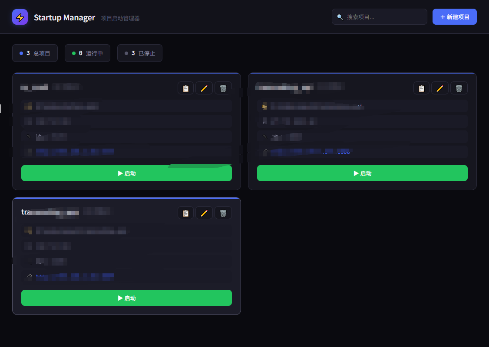

# Startup Manager

一个本地项目启动管理器，基于 Tauri v2 开发，用于集中管理和启动/停止多个开发项目进程。

## 功能特性

- 集中管理多个本地开发项目
- 一键启动/停止项目进程
- 实时查看项目运行日志
- 支持开机自启动
- 系统托盘最小化到后台运行
- 深色主题 UI，美观简洁

## 界面预览



## 下载安装

前往 [Releases](../../releases) 页面下载最新版本的安装包。

## 技术栈

- **后端**: Rust + Tauri v2
- **前端**: HTML/CSS/JavaScript (原生无框架)
- **打包**: Windows MSI 安装程序

## 开发

```bash
# 安装依赖
npm install

# 开发模式
npm run dev

# 构建生产版本
npm run build
```

## 数据存储

项目配置存储在 `%APPDATA%\startup-manager\projects.json`

## License

MIT
